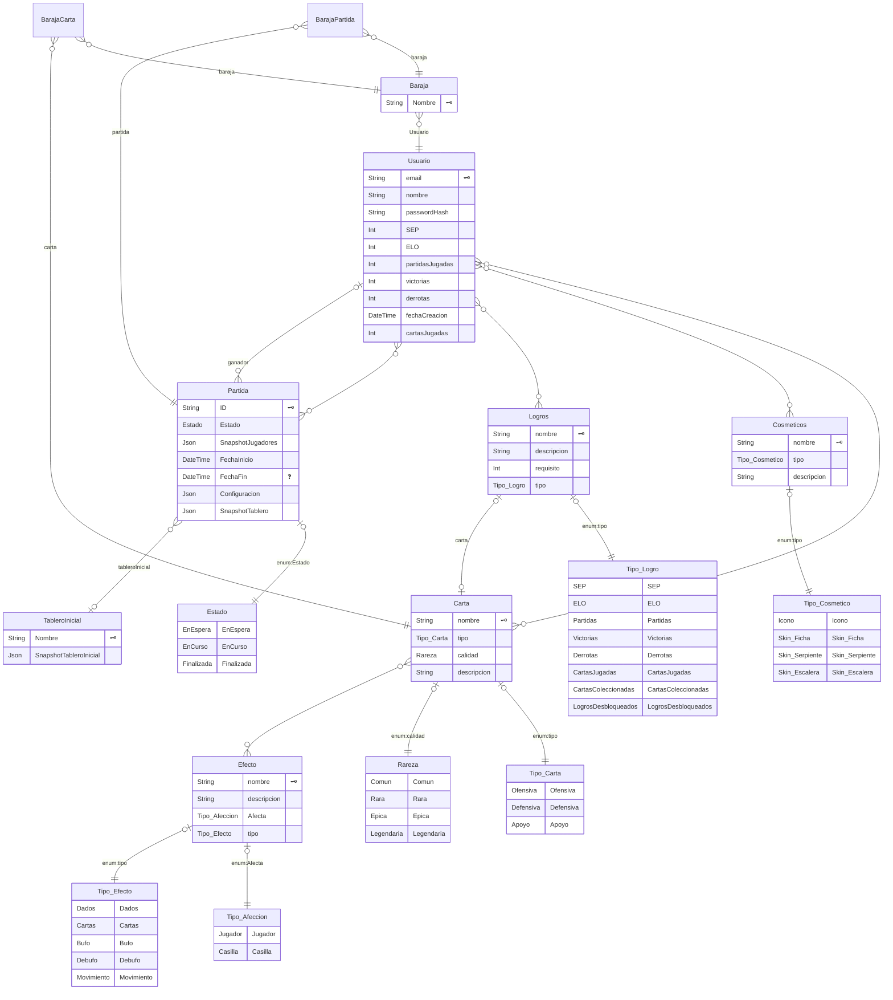

```mermaid
erDiagram

        Tipo_Carta {
            Ofensiva Ofensiva
Defensiva Defensiva
Apoyo Apoyo
        }
    


        Rareza {
            Comun Comun
Rara Rara
Epica Epica
Legendaria Legendaria
        }
    


        Tipo_Afeccion {
            Jugador Jugador
Casilla Casilla
        }
    


        Tipo_Efecto {
            Dados Dados
Cartas Cartas
Bufo Bufo
Debufo Debufo
Movimiento Movimiento
        }
    


        Tipo_Logro {
            SEP SEP
ELO ELO
Partidas Partidas
Victorias Victorias
Derrotas Derrotas
CartasJugadas CartasJugadas
CartasColeccionadas CartasColeccionadas
LogrosDesbloqueados LogrosDesbloqueados
        }
    


        Estado {
            EnEspera EnEspera
EnCurso EnCurso
Finalizada Finalizada
        }
    


        Tipo_Cosmetico {
            Icono Icono
Skin_Ficha Skin_Ficha
Skin_Serpiente Skin_Serpiente
Skin_Escalera Skin_Escalera
        }
    
  "Usuario" {
    String email "🗝️"
    String nombre 
    String passwordHash 
    Int SEP 
    Int ELO 
    Int partidasJugadas 
    Int victorias 
    Int derrotas 
    DateTime fechaCreacion 
    Int cartasJugadas 
    }
  

  "Carta" {
    String nombre "🗝️"
    Tipo_Carta tipo 
    Rareza calidad 
    String descripcion 
    }
  

  "Efecto" {
    String nombre "🗝️"
    String descripcion 
    Tipo_Afeccion Afecta 
    Tipo_Efecto tipo 
    }
  

  "Logros" {
    String nombre "🗝️"
    String descripcion 
    Int requisito 
    Tipo_Logro tipo 
    }
  

  "Partida" {
    String ID "🗝️"
    Estado Estado 
    Json SnapshotJugadores 
    DateTime FechaInicio 
    DateTime FechaFin "❓"
    Json Configuracion 
    Json SnapshotTablero 
    }
  

  "TableroInicial" {
    String Nombre "🗝️"
    Json SnapshotTableroInicial 
    }
  

  "Baraja" {
    String Nombre "🗝️"
    }
  

  "BarajaCarta" {

    }
  

  "BarajaPartida" {

    }
  

  "Cosmeticos" {
    String nombre "🗝️"
    Tipo_Cosmetico tipo 
    String descripcion 
    }
  
    "Usuario" o{--}o "Carta" : ""
    "Usuario" o{--}o "Cosmeticos" : ""
    "Usuario" o{--}o "Logros" : ""
    "Usuario" o{--}o "Partida" : ""
    "Carta" |o--|| "Tipo_Carta" : "enum:tipo"
    "Carta" |o--|| "Rareza" : "enum:calidad"
    "Carta" o{--}o "Efecto" : ""
    "Efecto" |o--|| "Tipo_Afeccion" : "enum:Afecta"
    "Efecto" |o--|| "Tipo_Efecto" : "enum:tipo"
    "Logros" |o--|| "Tipo_Logro" : "enum:tipo"
    "Logros" |o--|o "Carta" : "carta"
    "Partida" |o--|| "Estado" : "enum:Estado"
    "Partida" }o--|o "Usuario" : "ganador"
    "Partida" }o--|o "TableroInicial" : "tableroInicial"
    "Baraja" }o--|| "Usuario" : "Usuario"
    "BarajaCarta" }o--|| "Baraja" : "baraja"
    "BarajaCarta" }o--|| "Carta" : "carta"
    "BarajaPartida" }o--|| "Baraja" : "baraja"
    "BarajaPartida" }o--|| "Partida" : "partida"
    "Cosmeticos" |o--|| "Tipo_Cosmetico" : "enum:tipo"
```
